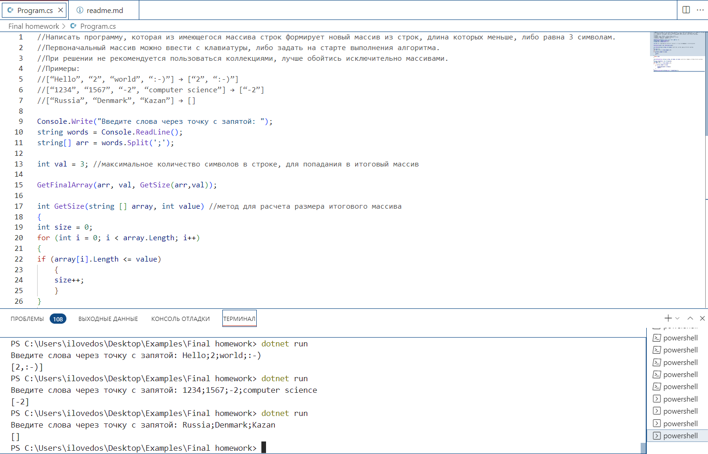

# Описание решения итоговой задачи:
1. _Вводим вручную необходимые строки и формируем из них массив. В качестве разделителя, выбираем **";"**._

2. _Для того чтобы определить размер итогового массива, в котором по заданию не может быть строк с количеством символов больше 3х, создаем метод. Данный метод перебирает все строки заданного массива и записывает в переменную **size** число строк, количество символов в которой меньше или равно 3м. После чего вовращает значение переменной **size**._

3. _Зная размер итогового массива создаем метод, который будет перебирать в цикле все элементы изначального массива и проверяя их на заданное условие (количество символов в строках массива не должно быть больше трёх), записывать в итоговый массив подходящие по условию строки. А также выведет на экран итоговый массив._

***Скриншот примеров выполнения программы в терминале***

